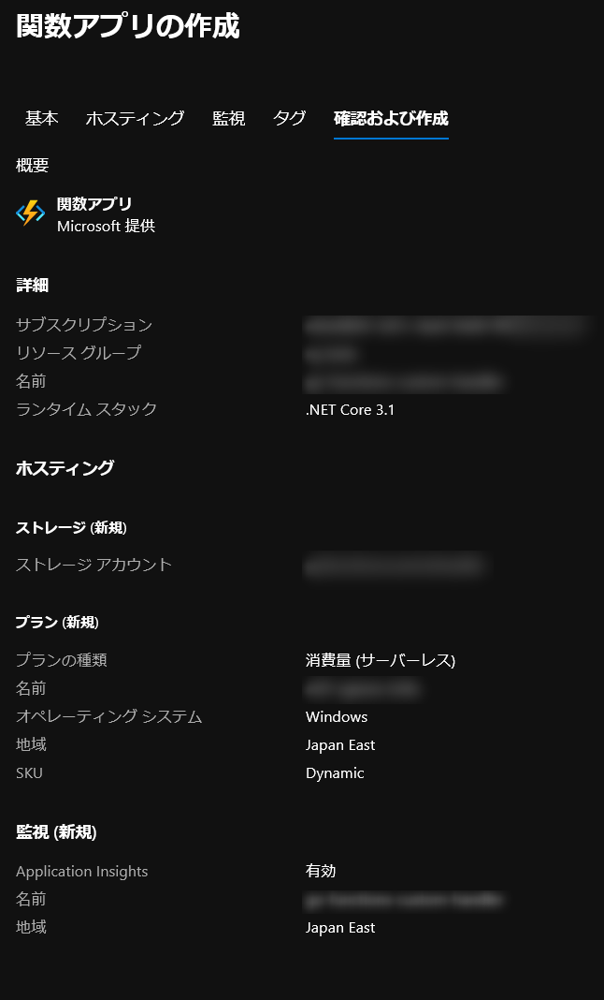

# Go Functions Cstom Handler

## build & run

:link: [Azure Functions のカスタム ハンドラー (プレビュー) | Microsoft Docs](https://docs.microsoft.com/ja-jp/azure/azure-functions/functions-custom-handlers)  

```powershell
PS go-functions-custom-handler> go build
PS go-functions-custom-handler> func start
```

[log](func-start.log)  

## deployment

### Azure Functions Setup

* Runtime: .Net Core 3.1




### Azure Functions Deploy

```powershell
PS go-functions-custom-handler> az login
PS go-functions-custom-handler> func azure functionapp publish <azure-functionapp-resourcename>
```

[log](deploy.log)  

https://<azure-functionapp-resourcename>/api/SimpleHttpTrigger?code=*************************************************


